<p align="center">
  
</p>

<p align="center">
  <strong>AWS Student Builder Group — TED University</strong><br />
  An animated, bilingual landing page for a community of curious builders.
</p>

<p align="center">
  <a href="#english">English</a> &nbsp; · &nbsp;
  <a href="#türkçe">Türkçe</a> &nbsp; · &nbsp;
  <a href="https://www.instagram.com/awstedu/">Instagram ↗</a> &nbsp; · &nbsp;
  <a href="https://www.linkedin.com/company/awstedu/">LinkedIn ↗</a>
</p>

<p align="center">
  <code>HTML</code> &nbsp; <code>CSS</code> &nbsp; <code>JavaScript</code> &nbsp; <code>SVG</code>
</p>

---

## English

A small introduction to the community: what brings us together, what we want to build, and where to find us. The visual identity pairs a dark canvas with violet cubes, warm accents, and motion that carries through the page.

### Inside the experience

| Feature | What you'll find |
| :--- | :--- |
| **Two languages** | Turkish and English, with a remembered language preference and direct `?lang=tr` / `?lang=en` links. |
| **Animated identity** | A looping 3D cube sequence, a clickable logo, scroll reveals, and animated headings. |
| **Responsive layout** | Layouts that adapt to screen size, with a smaller video asset for mobile. |
| **Accessible interactions** | Reduced-motion support, visible keyboard focus, and a skip-to-content link. |

### Open it locally

```bash
git clone https://github.com/IlkeOzcendek/aws-tedu-website.git
```

Open **`index.html`** in the downloaded folder. No installation or build step is needed.

### Design & development

**Built with AI assistance using OpenAI Codex.** I directed the visual design, made design decisions, reviewed the results, and refined the page through iterative feedback. The work evolved through changes to typography, spacing, colors, motion, and social cards.

The README cover is a vector adaptation of the site's cube animation. The website uses video for its 3D sequence and HTML, CSS, and vanilla JavaScript for its interface.

---

## Türkçe

Topluluğumuzu tanıtan küçük bir başlangıç: bizi bir araya getiren merak, birlikte üretme isteği ve bize ulaşabileceğin kanallar. Koyu zemin, mor küpler, sıcak renk vurguları ve sayfa boyunca devam eden hareketler görsel kimliği oluşturuyor.

### Sayfada neler var?

| Özellik | Deneyim |
| :--- | :--- |
| **İki dil** | Türkçe/İngilizce geçişi, hatırlanan dil tercihi ve doğrudan `?lang=tr` / `?lang=en` bağlantıları. |
| **Hareketli kimlik** | Döngüsel 3B küp animasyonu, tıklanabilir logo, kaydırmayla beliren içerikler ve hareketli başlıklar. |
| **Duyarlı tasarım** | Ekran boyutuna uyum sağlayan yerleşim ve mobil cihazlar için daha küçük video dosyası. |
| **Erişilebilir etkileşimler** | Azaltılmış hareket tercihi, görünür klavye odağı ve içeriğe atlama bağlantısı. |

### Bilgisayarında aç

Depoyu indir veya yukarıdaki komutla klonla. Klasördeki **`index.html`** dosyasını tarayıcıda açman yeterli; kurulum veya derleme gerekmiyor.

### Tasarım ve geliştirme

**OpenAI Codex ile, yapay zekâ destekli bir geliştirme süreci kullanıldı.** Görsel yönü belirledim, tasarım kararlarını verdim, sonuçları değerlendirdim ve geri bildirimlerle sayfayı geliştirdim. Tipografi, boşluklar, renkler, hareketler ve sosyal medya kartları bu süreçte şekillendi.

README kapağı, sitedeki küp animasyonunun vektör uyarlaması. Web sitesindeki 3B sahne video olarak oynatılıyor; arayüz HTML, CSS ve sade JavaScript ile çalışıyor.

---

<details>
<summary><strong>Project structure / Dosya yapısı</strong></summary>

```text
aws-tedu-website/
├── index.html       # Page content / Sayfa içeriği
├── styles.css       # Layout and motion / Tasarım ve hareket
├── app.js           # Translations and interactions / Dil ve etkileşimler
└── assets/          # Club mark, video, and SVG / Logo, video ve SVG
```

A static site with no backend. Language preferences are saved when browser storage is available. / Sunucu tarafı uygulaması bulunmayan statik bir site. Tarayıcı depolaması kullanılabildiğinde dil tercihi hatırlanır.

</details>

<details>
<summary><strong>Credits / Katkılar</strong></summary>

- Instagram and LinkedIn icons: [Bootstrap Icons](https://icons.getbootstrap.com/), used under the [MIT License](assets/LICENSE.bootstrap-icons.txt). This license applies to those icons.
- AWS, TED University, club, Instagram, and LinkedIn names and marks remain the property of their respective owners. / İsimler ve markalar ilgili sahiplerine aittir.

</details>
