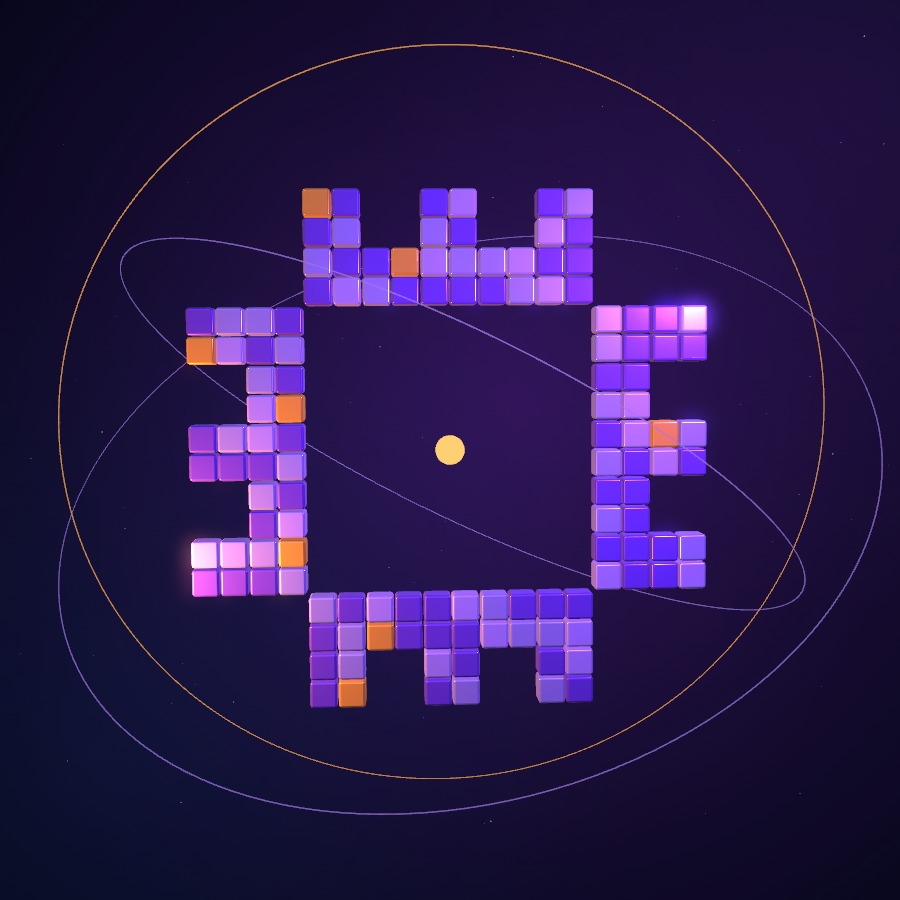

# AWS TEDU — Build together

A bilingual, animated introduction to **AWS Student Builder Group — TED University**, created to give the community an engaging home online.

[Watch the animation →](assets/hero-loop.mp4)

## English

### About the project

The page introduces the club through a looping 3D cube animation, short community-focused copy, and links to its social accounts. The visual direction grew through iterative feedback on layout, typography, color, and motion.

**Built with AI assistance using OpenAI Codex.** My role was to guide the visual direction, make design decisions, review the results, and steer successive improvements. This repository shares the outcome of that collaborative process.

### Features

- Turkish/English switch, with language preference saved locally when browser storage is available; `?lang=tr` and `?lang=en` are also supported.
- Responsive layout and a smaller animation asset for mobile screens.
- Clickable logo animation, scroll reveals, animated headings, and social-card hover effects.
- Reduced-motion support, keyboard focus styles, and a skip-to-content link.
- Direct links to [Instagram](https://www.instagram.com/awstedu/) and [LinkedIn](https://www.linkedin.com/company/awstedu/).

### Run locally

Download or clone the repository and open **`index.html`** in your browser. No installation or build step is required.

The site uses **HTML, CSS, and vanilla JavaScript**. `app.js` contains translations and interactions; `styles.css` defines layout and motion; `assets/` holds the club mark and animation files. It is a static site with no backend.

## Türkçe

### Proje hakkında

**AWS Student Builder Group — TED University** için hazırlanan bu sayfa; 3B küp animasyonu, kısa tanıtım metinleri ve sosyal medya bağlantılarıyla topluluğu tanıtıyor. Yerleşim, tipografi, renk ve hareketler geri bildirimlerle adım adım geliştirildi.

**OpenAI Codex ile, yapay zekâ destekli bir geliştirme süreci kullanıldı.** Ben görsel yönü belirledim, tasarım kararlarını verdim, sonuçları değerlendirdim ve geliştirme turlarını yönlendirdim. Bu depo, birlikte yürütülen sürecin sonucunu paylaşıyor.

### Özellikler ve kullanım

- Türkçe/İngilizce geçişi; tarayıcı depolaması kullanılabildiğinde hatırlanan dil tercihi ve `?lang=tr` / `?lang=en` desteği.
- Mobil uyumlu tasarım, tıklanabilir logo animasyonu, hareketli başlıklar ve sosyal medya kartları.
- Azaltılmış hareket tercihi, klavye odak göstergeleri ve içeriğe atlama bağlantısı.

Depoyu indirip **`index.html`** dosyasını tarayıcıda açman yeterli. Kurulum veya derleme gerekmiyor. HTML, CSS ve sade JavaScript ile hazırlanmış statik bir site; sunucu tarafı uygulaması bulunmuyor.

## Credits / Katkılar

- Instagram and LinkedIn icons: [Bootstrap Icons](https://icons.getbootstrap.com/), used under the [MIT License](assets/LICENSE.bootstrap-icons.txt).
- AWS, TED University, club, Instagram, and LinkedIn names and marks remain the property of their respective owners. / İsimler ve markalar ilgili sahiplerine aittir.
